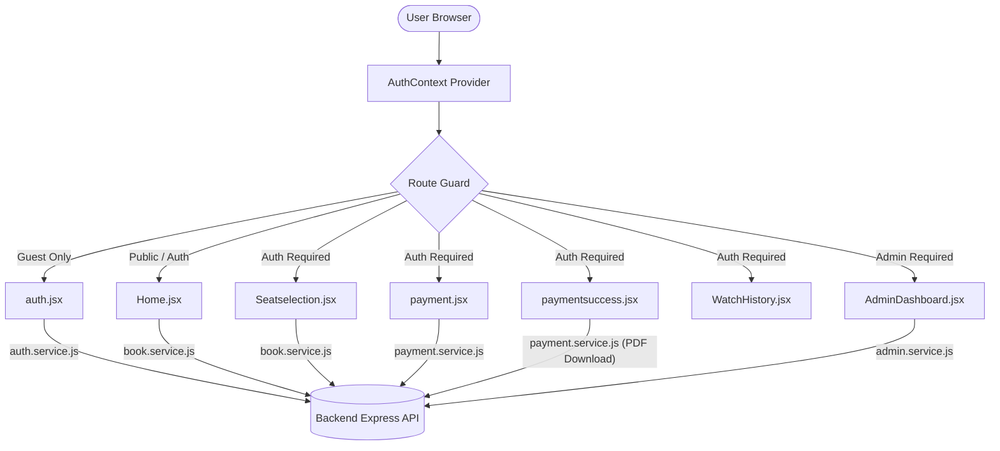

# 🚌 BusEase Frontend – End-to-End (E2E) Architecture & Testing Guide

This guide provides a comprehensive overview of how the **BusEase** frontend works, including architecture, application state flows, complete end-to-end user journeys, and a step-by-step testing manual.

---

## 📑 Table of Contents
1. [Frontend Architecture Overview](#-frontend-architecture-overview)
2. [Project & Folder Structure](#-project--folder-structure)
3. [Environment Configuration & Running Locally](#-environment-configuration--running-locally)
4. [Application State & Data Flow](#-application-state--data-flow)
5. [End-to-End (E2E) User Journeys & Workflows](#-end-to-end-e2e-user-journeys--workflows)
   - [Journey 1: Authentication & Password Recovery](#journey-1-authentication--password-recovery)
   - [Journey 2: Bus Search & Discovery](#journey-2-bus-search--discovery)
   - [Journey 3: Real-Time Seat Selection](#journey-3-real-time-seat-selection)
   - [Journey 4: Checkout & Payment Simulation](#journey-4-checkout--payment-simulation)
   - [Journey 5: Ticket Issuance & PDF Generation](#journey-5-ticket-issuance--pdf-generation)
   - [Journey 6: User Profile & Booking History](#journey-6-user-profile--booking-history)
   - [Journey 7: Administrator Management Console](#journey-7-administrator-management-console)
6. [Step-by-Step E2E Test Cases & Manual Test Suite](#-step-by-step-e2e-test-cases--manual-test-suite)
7. [Edge Cases & Error Handling](#-edge-cases--error-handling)

---

## 🏛 Frontend Architecture Overview

The BusEase frontend is built with **React 18** and **Vite**, using a modular component structure, centralized Context API state management, and unified Axios service layers.

- **Build Tool:** Vite 7 for fast HMR and optimized production bundles.
- **Routing:** React Router v6 with `lazy()` code splitting, `Suspense`, and route protection guards.
- **Styling:** Tailwind CSS with modern dark-mode aesthetics and responsive layouts.
- **Icons:** `lucide-react` for clean UI iconography.
- **HTTP Client:** `axios` with interceptors handling credentials (`cookies`), rate limits, and unified error parsing.
- **Document Generation:** Dual-mode ticket printing (Server-side PDF streaming + Client-side `jspdf` fallback).

---

## 📁 Project & Folder Structure

```
Frontend/
├── src/
│   ├── App.jsx                   # Central route configurations & warm-up triggers
│   ├── main.jsx                  # Entry point mounting root DOM element
│   ├── index.css                 # Global styles and Tailwind directives
│   ├── components/               # Reusable UI components
│   │   ├── ErrorBoundary.jsx     # Graceful crash handling
│   │   ├── Forgetpassword.jsx    # Password recovery modal/page
│   │   ├── Header.jsx            # Dynamic navigation bar & user menu
│   │   ├── ProtectedRoute.jsx    # Guard for guest-only, auth-only, and admin-only routes
│   │   ├── Skeleton.jsx          # Loading skeleton placeholders
│   │   └── ToastProvider.jsx     # Global toast notification system
│   ├── context/
│   │   └── Authcontext.jsx       # Global authentication context & state persistence
│   ├── pages/                    # Core view pages
│   │   ├── auth.jsx              # Sign in & Sign up tabbed interface
│   │   ├── Home.jsx              # Route search and bus inventory view
│   │   ├── Seatselection.jsx     # Interactive seat layout matrix
│   │   ├── payment.jsx           # Passenger information & payment simulation
│   │   ├── paymentsuccess.jsx    # Booking confirmation & ticket downloads
│   │   ├── Profile.jsx           # User profile details
│   │   ├── WatchHistory.jsx      # Past and upcoming trip history
│   │   ├── AdminDashboard.jsx    # Admin metrics, bus/route/booking management
│   │   └── AdminUsers.jsx        # Admin user role assignment interface
│   └── services/                 # API service layer (Axios wrappers)
│       ├── apiClient.js          # Shared Axios instance with base URL & cookies
│       ├── auth.service.js       # Login, register, logout, session check
│       ├── book.service.js       # Bus search, seat inventory, trip booking
│       ├── payment.service.js    # Payment simulation & server PDF download
│       ├── route.service.js      # Public/protected route lookup
│       ├── admin.service.js      # Admin dashboard stats, bus/route CRUD
│       ├── booking.admin.service.js # Admin booking cancellations, refunds, PDF downloads
│       └── user.admin.service.js # Admin user list and role management
```

---

## ⚙️ Environment Configuration & Running Locally

Create a `.env` file in the `Frontend/` folder:

```env
# Backend API Base URL
VITE_BASE_URL=http://localhost:8000/api/v1
```

### Quick Start Commands

```bash
# Navigate to frontend
cd Frontend

# Install dependencies
npm install

# Start development server (runs on http://localhost:5173 by default)
npm run dev

# Build for production
npm run build

# Preview production build
npm run preview
```

---

## 🔄 Application State & Data Flow



1. **Authentication Session:** `AuthContext` queries `GET /users/current-user` on app load to restore user state via secure HTTP-only cookies.
2. **Route Guards:**
   - `guestOnly`: Redirects logged-in users to `/home`.
   - `requireAuth`: Redirects unauthenticated users to `/auth`.
   - `requireAdmin`: Checks `user.role === 'admin' || user.role === 'superadmin'`; redirects standard users to `/home`.
3. **Toast Alerts:** Global `ToastProvider` provides contextual success/error popups across all async operations.

---

## 🚀 End-to-End (E2E) User Journeys & Workflows

### Journey 1: Authentication & Password Recovery
- **Pages:** `/auth`, `/forget-password`
- **Flow:**
  1. User enters `/auth` and switches between **Sign In** and **Sign Up**.
  2. Submitting **Sign Up** calls `registerUser()`. On success, auto-switches to Sign In or signs the user in.
  3. Submitting **Sign In** calls `loginUser()`, updates `AuthContext` with user metadata, and navigates to `/home`.
  4. Clicking **Forgot Password** navigates to `/forget-password` where the user inputs their email to receive a recovery token.

### Journey 2: Bus Search & Discovery
- **Pages:** `/home`
- **Flow:**
  1. User specifies **Origin**, **Destination**, and **Travel Date**.
  2. Frontend queries `searchBuses({ origin, destination, date })`.
  3. Displays matching buses with details:
     - Bus Number & Operator
     - Total available seats
     - Amenities (WiFi, Charging, AC, etc.)
     - Departure & Arrival time estimates
     - Base ticket fare
  4. User clicks **Select Seats** on their chosen bus, navigating to `/buses/:busId/seats?date=YYYY-MM-DD`.

### Journey 3: Real-Time Seat Selection
- **Pages:** `/buses/:busId/seats`
- **Flow:**
  1. Fetches real-time seat inventory for the specified bus and travel date via `getBusSeats()`.
  2. Renders interactive 2x2 grid representing bus seating layout.
  3. State visualization:
     - ⚪ **Available:** Gray / Clickable
     - 🟢 **Selected:** Cyan / Active selection
     - 🔴 **Booked:** Dark muted / Disabled
  4. User selects 1 or more seats. A sticky summary bar recalculates total price in real time (`seatCount * fare`).
  5. User clicks **Proceed to Payment**, passing state to `/payment`.

### Journey 4: Checkout & Payment Simulation
- **Pages:** `/payment`
- **Flow:**
  1. Displays booking summary (Origin, Destination, Travel Date, Selected Seat Numbers, Total Fare).
  2. User fills in passenger contact details (Full Name, Age, Gender, Email, Phone Number).
  3. User enters test payment details (Simulation Mode – no real credit/debit card data is processed or stored).
  4. Submitting triggers `processPayment()`:
     - Creates transaction and claims seats atomically in backend inventory.
     - Receives `transactionReference`, `bookingId`, and booking details.
  5. Navigates automatically to `/success` with booking payload.

### Journey 5: Ticket Issuance & PDF Generation
- **Pages:** `/success`
- **Flow:**
  1. Displays green confirmation banner, booking ID, passenger details, and route summary.
  2. Background email confirmation is automatically dispatched with ticket PDF attached.
  3. User has two download options:
     - 📄 **Download Official PDF (Server):** Calls `downloadBackendTicketPdf(bookingId)` to stream the official vector PDF ticket generated via backend PDFKit.
     - 🖨️ **Download Client PDF (Backup):** Generates immediate client-side PDF ticket using `jsPDF`.

### Journey 6: User Profile & Booking History
- **Pages:** `/profile`, `/history`
- **Flow:**
  1. `/profile`: Displays user profile avatar, username, email, role, and quick links.
  2. `/history`: Queries `getUserBookings()` and renders trip history cards sorted chronologically.
  3. Shows booking reference, route, travel date, seat numbers, fare, and status (`confirmed`, `cancelled`, `refunded`).

### Journey 7: Administrator Management Console
- **Pages:** `/admin`, `/admin/users` (Restricted to `admin` / `superadmin`)
- **Flow:**
  1. **Overview Tab:** Shows system metrics (Total revenue, active buses, total routes, recent bookings).
  2. **Buses Tab:** Add new buses, configure capacity and amenities, toggle active/inactive status.
  3. **Routes Tab:** Create new routes (Origin, Destination, Date, Distance, Duration), delete routes, toggle status.
  4. **Bookings Tab:** Search bookings by reference or username, filter by status, initiate cancellations/refunds, and download official PDF tickets.
  5. **Users Management (`/admin/users`):** View all registered users, promote users to admin, or update roles.

---

## 🧪 Step-by-Step E2E Test Cases & Manual Test Suite

| Test ID | Scenario | Steps | Expected Result |
|---|---|---|---|
| **E2E-01** | User Registration & Login | 1. Go to `/auth`<br>2. Fill sign up form<br>3. Submit and log in | User is authenticated, redirected to `/home`, and header displays username. |
| **E2E-02** | Bus Search with Valid Criteria | 1. On `/home`, input Origin (e.g. `Mumbai`), Destination (`Pune`), and Date<br>2. Click Search | Search results load showing matching buses with prices and available seats. |
| **E2E-03** | Bus Search with No Matches | 1. Search for non-existent route (e.g. `CityA` to `CityB`) | Shows friendly empty-state message indicating no buses are available. |
| **E2E-04** | Interactive Seat Selection | 1. Click "Select Seats"<br>2. Select Seat 12 and Seat 14<br>3. Check price calculation | Selected seats turn cyan, total price equals $2 \times \text{fare}$, and Proceed button is enabled. |
| **E2E-05** | Payment Simulation & Booking | 1. Proceed to `/payment`<br>2. Enter passenger info<br>3. Click Pay Now | Loader displays, payment succeeds, and user is redirected to `/success` with booking ID. |
| **E2E-06** | Server-Side PDF Ticket Download | 1. On `/success`, click "Download Official PDF (Server)" | Browser downloads `BusEase-Ticket-<id>.pdf` formatted with barcode and itinerary. |
| **E2E-07** | Client-Side jsPDF Download | 1. On `/success`, click "Download Client PDF (Backup)" | Instant client-side PDF downloads without server roundtrip. |
| **E2E-08** | Booking History Verification | 1. Navigate to `/history` | The newly booked ticket appears with status `confirmed` and accurate seat details. |
| **E2E-09** | Unauthorized Route Protection | 1. Log out<br>2. Manually navigate to `/profile` or `/admin` | User is intercepted and redirected to `/auth`. |
| **E2E-10** | Admin Dashboard Permissions | 1. Log in with admin credentials<br>2. Open `/admin`<br>3. Add new route and manage bookings | Admin can create routes, view all bookings, cancel/refund tickets, and export PDFs. |

---

## 🛡️ Edge Cases & Error Handling

1. **Session Expiry:** If a JWT cookie expires during navigation, Axios interceptors detect `401 Unauthorized`, clear local auth state, and prompt the user to re-authenticate without crashing.
2. **Double Booking Prevention:** If two users select the same seat concurrently, the backend transaction fails the second request; frontend displays a toast stating *"Seat already reserved, please select another seat."*
3. **Offline / Fallback Downloads:** If the backend PDF generation endpoint is temporarily unreachable, the frontend automatically falls back to client-side `jsPDF` ticket generation.
4. **Form Validation:** All forms (Auth, Route search, Passenger checkout) include client-side validation to guard against empty strings, invalid email formats, and negative numerical values.
