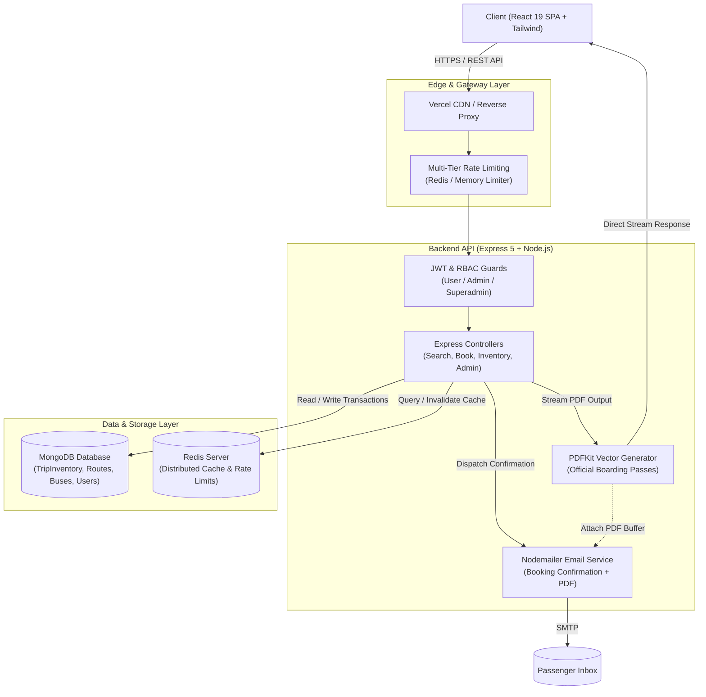
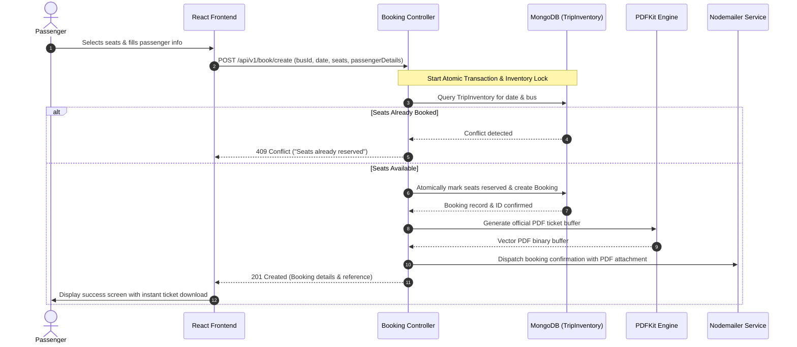

<<<<<<< HEAD
# 🚌 BusEase – Modern Bus Ticket Booking Platform
=======
# 🚌 BusEase – Your Easy Bus Booking Companion (Live only at :- https://bus-ease-omega.vercel.app)
>>>>>>> 1e531886c1b9f4f5f622d66b55d6756e5182ccf9

[](https://bus-ease-beta.vercel.app)
[](https://nodejs.org)
[](https://react.dev)
[](https://www.mongodb.com)
[](https://redis.io)

**BusEase** is a full-stack, enterprise-grade bus ticket booking web application designed for seamless trip discovery, visual seat reservation, simulated payment processing, and automated ticket generation. Built with a high-performance MERN architecture, BusEase provides a modern responsive user interface paired with a secure, scalable backend.

> ℹ️ **Payment Simulation:** Payments are strictly for demonstration. BusEase does not process real financial transactions and never requests, captures, or stores sensitive credit/debit card numbers, CVVs, or card PINs.

---

## 🏛 System Architecture

### 1. High-Level Architecture Overview



---

### 2. Booking & Seat Allocation Lifecycle



---

## 🚀 Key Features

### 👤 Passenger Experience
- **Authentication & Security:** Secure JWT session persistence via HTTP-only cookies, password encryption with `bcrypt`, and password recovery flows.
- **Route & Bus Search:** Filter buses by Origin, Destination, and Travel Date with instant schedule lookup.
- **Interactive Visual Seat Matrix:** Real-time 2x2 grid seating map displaying Available, Selected, and Booked states with dynamic fare calculations.
- **Safe Payment Simulation:** Generates unique demonstration transaction references and booking identifiers without processing actual cards.
- **Dual-Mode Ticket Generation:** 
  - **Official Server PDF:** Streamed directly from backend PDFKit engine with high-resolution layout and barcodes.
  - **Client-Side jsPDF Backup:** Instant offline fallback ticket generation directly in the browser.
- **Automated Email Confirmations:** Instant email delivery containing the trip itinerary and attached vector PDF ticket.
- **Trip History & Profile:** View past and upcoming trips, booking statuses (`confirmed`, `cancelled`, `refunded`), and user profile information.

### 🛡️ Administrator Operations Console
- **Role-Based Access Control (RBAC):** Tiered permissions supporting `user`, `admin`, and `superadmin` privileges.
- **Operational Metrics Dashboard:** Real-time insights into total revenue, active buses, scheduled routes, and recent reservations.
- **Fleet Management:** Create, configure capacity, update amenities, and toggle active/inactive status for buses.
- **Route Management:** Add new routes with distance and duration constraints, delete routes, and manage schedules.
- **Booking Management:** Search bookings by reference or username, filter by status, initiate cancellations, process refunds, and download tickets.
- **User Role Administration:** Promote users and manage administrative access privileges.

### ⚡ Reliability & Performance
- **Atomic Seat Inventory (`TripInventory`):** Isolated per-bus and per-date seat availability records preventing double-booking race conditions.
- **Distributed Caching & Rate Limiting:** Redis-backed caching for high-traffic search routes with automatic MongoDB/memory fallback.
- **Automated Maintenance Jobs:** Built-in scripts and Vercel daily cron jobs for maintaining future trip inventories.

---

## 🛠 Tech Stack

| Domain | Technology | Purpose |
|---|---|---|
| **Frontend Framework** | React 19 / Vite 7 | High-performance Single Page Application (SPA) |
| **Frontend Routing** | React Router v7 | Client-side routing with lazy loading & guards |
| **Styling & UI** | Tailwind CSS v4, Lucide Icons | Responsive modern UI with dark-theme styling |
| **Backend Framework** | Node.js / Express 5 | Modular REST API server |
| **Database & ODM** | MongoDB / Mongoose 8 | Document storage with schema validation & transactions |
| **In-Memory Cache** | Redis 5 | Distributed caching & centralized rate limiting |
| **PDF Generation** | PDFKit | Low-memory vector PDF boarding pass generation |
| **Email Delivery** | Nodemailer | Transactional email dispatch with attachments |
| **Authentication** | JSON Web Tokens (JWT), Bcrypt | Stateless cookie sessions and password hashing |

---

## 📁 Project Structure

```
BusEase/
├── Backend/                       # Node.js & Express REST API
│   ├── api/                       # Vercel serverless entry point
│   ├── scripts/                   # Migration & maintenance automation scripts
│   │   ├── maintain-inventory.js  # Daily trip inventory generator
│   │   ├── migrate-booking-ids.js # Legacy booking reference migration
│   │   ├── migrate-inventory.js   # Initial seat inventory migration
│   │   └── seed-superadmin.js     # Superadmin initial seeder
│   ├── src/
│   │   ├── index.js               # Application startup entry point
│   │   ├── app.js                 # Express application & middleware stack
│   │   ├── constants.js           # Global constants & defaults
│   │   ├── Controllers/           # Route logic (Admin, Booking, Bus, Payment, Search, etc.)
│   │   ├── Db/                    # MongoDB connection configuration
│   │   ├── middlewares/           # Auth, Role, Admin Audit, and Rate Limiting guards
│   │   ├── models/                # Mongoose schemas (Bus, Route, TripInventory, User, etc.)
│   │   ├── routes/                # Express API route declarations
│   │   └── utils/                 # Helpers (PDF generator, Nodemailer, Cache, Redis, Validation)
│   ├── package.json
│   └── vercel.json
│
├── Frontend/                      # React SPA (Vite)
│   ├── public/                    # Static public assets
│   ├── src/
│   │   ├── main.jsx               # React DOM root entry
│   │   ├── App.jsx                # Route declarations and app warm-up
│   │   ├── index.css              # Global styles & Tailwind directives
│   │   ├── components/            # Reusable UI components (Header, Modal, ProtectedRoute, Toast)
│   │   ├── context/               # AuthContext state provider
│   │   ├── pages/                 # Views (Home, Auth, SeatSelection, Payment, AdminDashboard, etc.)
│   │   └── services/              # API Client & Axios service modules
│   ├── package.json
│   ├── vite.config.js
│   └── vercel.json
│
├── .gitignore
├── README.md                      # Primary project documentation
└── Frontend/README.md             # Detailed Frontend E2E Testing Guide
```

---

## 🚀 Setup & Installation Guide

### Prerequisites
- **Node.js:** v18.0.0 or later
- **npm:** v9.0.0 or later
- **MongoDB:** Local instance or MongoDB Atlas cluster URI
- **Redis (Optional):** Local Redis or cloud provider (e.g., Upstash)

---

### Step 1: Clone the Repository

```bash
git clone https://github.com/Nikhil-X-codes/BusEase.git
cd BusEase
```

---

### Step 2: Backend Configuration & Setup

1. Navigate to the backend directory and install dependencies:
   ```bash
   cd Backend
   npm install
   ```

2. Create a `.env` configuration file in `Backend/`:
   ```env
   # Server Configuration
   PORT=8000
   CORS_ORIGIN=http://localhost:5173

   # Database
   MONGODB_URI=mongodb+srv://<username>:<password>@cluster.mongodb.net/busease?retryWrites=true&w=majority

   # JWT Secrets
   ACCESS_TOKEN_SECRET=your_super_secret_access_jwt_key
   ACCESS_TOKEN_EXPIRY=1d
   REFRESH_TOKEN_SECRET=your_super_secret_refresh_jwt_key
   REFRESH_TOKEN_EXPIRY=10d

   # Redis Caching (Optional for local dev)
   REDIS_URL=redis://localhost:6379

   # Email Delivery (Nodemailer SMTP)
   SMTP_HOST=smtp.gmail.com
   SMTP_PORT=587
   SMTP_USER=your_email@gmail.com
   SMTP_PASS=your_email_app_password
   EMAIL_FROM="BusEase Support <support@busease.com>"

   # Automation & Admin Security
   CRON_SECRET=your_secure_cron_job_secret
   ADMIN_IP_WHITELIST=127.0.0.1,::1
   ```

3. Run database migrations & seed superadmin:
   ```bash
   # Migrate bus seat inventories
   npm run migrate:inventory

   # Seed the default superadmin account
   npm run seed:superadmin
   ```

4. Start the backend development server:
   ```bash
   npm run dev
   ```
   *The backend will be running at `http://localhost:8000`.*

---

### Step 3: Frontend Configuration & Setup

1. Open a new terminal, navigate to `Frontend/`, and install dependencies:
   ```bash
   cd ../Frontend
   npm install
   ```

2. Create a `.env` configuration file in `Frontend/`:
   ```env
   VITE_BASE_URL=http://localhost:8000/api/v1
   ```

3. Start the frontend development server:
   ```bash
   npm run dev
   ```
   *The frontend will launch at `http://localhost:5173`.*

---

## 🧪 Testing & Quality Assurance

BusEase includes a dedicated frontend end-to-end testing suite guide.

- 📖 **[Read the Frontend E2E Testing Guide](Frontend/README.md)** for:
  - Complete user journeys & test cases (`E2E-01` to `E2E-10`).
  - Interactive seat matrix and payment simulation validation.
  - PDF generation and email delivery verification steps.
  - Edge case and error handling checklists.

---

## 🔒 Security & Rate Limiting

- **General Reads:** 100 requests per IP / 15 minutes.
- **Authentication Routes:** 5 requests per IP / 15 minutes.
- **Booking Creation:** 10 requests per user / 1 hour.
- **Admin Endpoints:** 200 requests per admin IP / 15 minutes (with IP guard support).
- **HTTP-Only Cookies:** Auth cookies are set with `SameSite`, `HttpOnly`, and `Secure` attributes in production.

---

## 📄 License

This project is licensed under the **ISC License**. Feel free to use and contribute!


